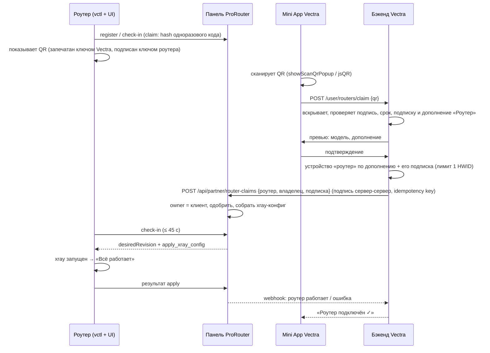

# ADR-0006 Онбординг роутера по QR из приложения Vectra

## Контекст

Сейчас новый роутер доходит до работающего VPN только руками оператора
(ADR-0002 автоматизировал шаги, но начало — всё равно оператор). Факты
(2026-09-28, ветка `claude/funny-brahmagupta-0f2eab`, Vectra Connect `origin/main`):

- **Роутер (vctl)** на первом старте создаёт себе личность: `device_identifier`
  (`vectra-<12 hex>`) и ключ ed25519 (`internal/state/state.go`). Регистрация
  открытая (`POST /api/router/register`), роутер получает токен и ждёт
  одобрения. Приватный ключ пока ничего не подписывает.
- **Панель** держит роутер в `pending`, пока оператор его не одобрит. Одобрение
  требует «импорта» конфига, а импорт умеет присылать только старый агент на
  PassWall — **новый xray-роутер сейчас одобрить нечем** (`fleet.ts`
  approveImportedBaseline ← `router-control.ts` passwallImport). Подписку
  оператор вставляет руками (`draft.configureXray`, только `https://`).
  Владельца у роутера в базе нет. Переименование до xray-роутеров не доходит.
- **Vectra Connect**: бот (aiogram) + Mini App (Telegram и app.vectra-pro.net).
  В Mini App **уже есть сканер QR** (`showScanQrPopup` + запасной jsQR —
  подключение телевизора, `pages/Connect/TVSteps.tsx`) и временные ссылки
  настройки на 15 минут (`/user/temp-link`). `/start` уже разбирает префиксы
  (`family_`, `qr_`, `ref_`…). Устройство клиента — слот в тарифе (3, семья 10),
  в режиме «устройство на пользователя» у каждого свой RemnaWave-юзер с
  лимитом 1 HWID. Клиентам выдаются только crypt5-ссылки.
- **Антифрод Connect** считает устройство роутером парка, только если модель
  из списка И User-Agent пустой или `passwall…`. UA vctl (`v2rayNG/1.9.5`,
  временная заглушка) под это не попадает — роутер на vctl рискует получить
  страйк как «чужой клиент».

## Решение

Клиент подключает роутер сам, одним сканированием в приложении Vectra.
Роутер показывает QR, который понимает только бэкенд Vectra; бэкенд заводит
роутеру слот устройства и сам передаёт его панели; панель одобряет и
настраивает роутер без оператора.

### Сценарий глазами клиента

1. Включает роутер, вставляет кабель интернета, подключается к его Wi-Fi.
2. Открывает страницу роутера → Vectra (простой режим). Там:
   «Роутер ещё не подключён к вашему аккаунту Vectra» · QR · код из
   8 символов · кнопка «Открыть в Telegram» (для случая, когда страница
   открыта на том же телефоне и сканировать нечем).
3. В приложении Vectra → «Подключить роутер» (рядом с «Телевизор»,
   тот же сканер) → наводит камеру.
4. Приложение показывает: «Xiaomi AX3000T · дополнение «Роутер» к вашей
   подписке · [Подключить]» (нет дополнения — «Докупить «Роутер»», оплата
   прямо в приложении, и подключение продолжается само). Одно нажатие.
5. Через ≤ 1 минуту страница роутера сама меняется на «Всё работает»,
   в приложении — «Роутер подключён ✓». Оператор не участвует.

### Что в QR

Строка `VECTRA:R1:<base64url>`. Внутри — конверт, запечатанный открытым
ключом бэкенда Vectra (X25519 → HKDF-SHA256 → AES-256-GCM; ключ зашит в пакет
роутера, с номером ключа для смены). Открыть его может только бэкенд Vectra:
обычная камера и чужие приложения видят бессмыслицу. В конверте:

| поле | зачем |
|---|---|
| `v`, `kid` | версия формата, номер ключа Vectra |
| `did`, `rid` | `device_identifier` и `router_id` (если уже зарегистрирован) |
| `pk` | открытый ключ ed25519 роутера |
| `n` | одноразовый код привязки, 128 бит, меняется каждые 10 минут |
| `exp` | срок действия |
| `model` | модель — для превью в приложении |
| `sig` | подпись ed25519 роутера над всем выше: QR нельзя подделать для чужого роутера |

Короткий код (8 символов, base32 Крокфорда, без похожих букв) — производная
того же одноразового кода; роутер отдаёт панели на check-in только его хеш.
Код вводится в приложении руками или приходит диплинком
`t.me/<бот>?start=rt_<код>`.

### Изменения по системам

**Роутер (vctl + UI, этот репозиторий).**
- `status.claim`: `unclaimed | pending | claimed`, маска владельца, срок кода;
  новый метод `claim_qr` отдаёт текущий QR и код (только авторизованному LuCI;
  под замком оператора — тоже, это простой режим).
- Смена кода каждые 10 минут; хеш кода — в check-in.
- Простой экран «не подключён»: QR (SVG, кодировщик ~4 КБ), код, кнопка
  «Открыть в Telegram», шаги, живой статус «ждём подтверждения…».
- UA подписки: `VectraRouter/<версия> (<модель>)` вместо заглушки.

**Панель ProRouter.**
- `router.owner_ref` (внешний ID клиента Vectra, без личных данных),
  `router.claim_state`, `claim_code_hash`, `claimed_at`.
- `POST /api/partner/router-claims` — только сервер-сервер: подпись HMAC
  с секретом окружения, `Idempotency-Key`, окно по времени против повтора.
  Проверяет: подпись роутера над конвертом, срок, совпадение хеша кода с
  последним check-in (если роутер уже на связи).
- Заявленный xray-роутер одобряется без импорта PassWall (закрывает дыру
  «нечем одобрить»); конфиг собирается из подписки, которую передал бэкенд.
- Если роутер ещё ни разу не выходил на связь — запись создаётся заранее по
  `device_identifier`; при первой регистрации он уже «свой» и одобрен.
- Вебхук в бэкенд Vectra: `router.claimed`, `router.ready`, `router.failed`.
- Переименование и прочие джобы — доходят и до xray-роутеров.

**Vectra Connect (бот, Mini App, бэкенд).**
- Mini App: карточка «Роутер» в «Подключить устройство»; сканер из TV-потока;
  ручной ввод кода; экран превью и статуса.
- Бот: префикс `rt_` в `/start` → сразу экран подключения роутера.
- Бэкенд: вскрытие и проверка QR; дополнение «Роутер» к подписке (докупается,
  не отнимает мест у устройств клиента: одно дополнение — один роутер; цена и
  срок — в настройках); тип устройства `router`; подписка устройства (сырая `https://` для роутера, а позже — своя
  зашифрованная ссылка, отдельная задача); вызов панели; статусы; «Отвязать».
- Антифрод: устройства типа `router` и UA `VectraRouter/…` — признаваемый
  клиент, не «подделка Happ».

### Безотказность: каждый отказ и выход из него

| что случилось | что видит клиент | что происходит |
|---|---|---|
| у роутера нет интернета | на роутере: «Подключите кабель провайдера в порт WAN» | QR показывается, привязка завершится, когда роутер выйдет на связь |
| роутер ни разу не был в панели | ничего особенного | панель создаёт запись заранее по `device_identifier` |
| QR устарел (> 10 мин) | в приложении: «Код устарел — страница роутера обновит его сама» | роутер сам меняет QR; повторный скан |
| страница открыта на том же телефоне | кнопка «Открыть в Telegram» / ввод кода | диплинк `rt_<код>` |
| камера недоступна | «Ввести код вручную» | то же, по коду |
| роутер уже привязан к этому аккаунту | «Уже подключён ✓» | ничего, идемпотентно |
| роутер привязан к другому аккаунту | «Роутер привязан к другому аккаунту. Если он ваш — напишите в поддержку» | поддержка видит оба аккаунта и роутер |
| нет подписки или дополнения «Роутер» | «Докупите «Роутер» к подписке, чтобы подключить его» → оплата | заявка ждёт 24 ч и завершается после оплаты |
| дополнение уже занято другим роутером | «К подписке уже подключён роутер: заменить его этим?» | старый отвязывается, новый подключается |
| подписка или дополнение закончились позже | на роутере: «Подписка закончилась — продлите в приложении Vectra» | панель снимает конфиг, роутер показывает статус и QR |
| панель недоступна для бэкенда | «Роутер подключается… до пары минут» | бэкенд повторяет вызов с тем же idempotency key |
| конфиг не применился на роутере | в приложении: «Не удалось запустить VPN на роутере, поддержка уже видит»; на роутере — простой экран с причиной и отчётом | вебхук `router.failed` → тикет |
| сброс роутера к заводским | роутер снова «не подключён» | новый скан; бэкенд узнаёт тот же HWID и заменяет старый слот, а не занимает второй |
| продажа/передача роутера | в приложении: «Отвязать роутер» | панель снимает владельца и конфиг; роутер возвращается к QR |

### Безопасность

- QR читает только бэкенд Vectra; подписан ключом роутера — подделать
  привязку чужого роутера нельзя.
- Код одноразовый и живёт 10 минут; повтор отбивается хешем кода из
  последнего check-in.
- QR видит только тот, кто вошёл на страницу роутера (LuCI).
- Утёкшее фото QR бесполезно через 10 минут и после первой привязки;
  владелец виден на странице роутера («Подключён к аккаунту …»), отвязать
  может владелец и поддержка.
- Роутер не получает ничего от аккаунта клиента, кроме подписки своего слота
  (лимит 1 HWID, отзывается отдельно).
- Панель и бэкенд говорят только сервер-сервер, с подписью и защитой от
  повтора; из браузера клиента панель не вызывается.

## Решения владельца (2026-09-28)

1. **Роутер — платное дополнение к подписке клиента**: докупается к
   действующей подписке, места у устройств клиента не занимает, одно
   дополнение — один роутер. Цена и срок — в настройках, в коде цифр нет.
2. **QR — на странице Vectra в LuCI** (за паролем роутера; пароль — на
   карточке в коробке). Отдельной страницы без пароля нет.
3. **Подтверждения на самом роутере нет**: одного скана хватает — вход в LuCI
   уже доказывает доступ, код одноразовый и живёт 10 минут.

## Выкат и проверка

1. Роутер + панель: `claim_qr`, код, check-in, партнёрский эндпоинт,
   одобрение без импорта. Проверка — сценарий стенда `MODE=claim` с
   поддельным бэкендом: QR → привязка → конфиг → пакеты через xray.
2. Бэкенд + Mini App + бот за флагом; e2e в дев-обвязке Mini App.
3. Пилот: роутер 1111111111 и тестовый аккаунт.
4. Парк — после пилота, по одному роутеру, как в ADR-0002.

## Последствия

- Оператор больше не нужен для нового роутера; одобрение и конфиг —
  следствие привязки к оплаченному аккаунту.
- Закрываются две текущие дыры: xray-роутер нечем одобрить, антифрод не
  узнаёт vctl.
- Появляется связь двух систем (панель ↔ бэкенд Vectra): её нужно
  мониторить и держать идемпотентной.

## Реализация (2026-09-28)

- **Роутер, vctl 0.5.0**: мастер настройки (интернет только проверяется —
  роутер подключается сам), коды и QR привязки, `claim` в check-in,
  «Мои сайты», стирание конфига прежнего владельца по `released`. Стенд:
  режимы `setup` и `ui` (дата-план доказан на пакетах).
- **Панель** (коммит `d9475dd`): партнёрский API `/api/partner/router-claims`
  (HMAC + Idempotency-Key, UA подписки обязателен), вебхуки
  `router.claimed` / `ready` / `failed`, отвязка → `released`, миграции
  0016–0017. Не задеплоено.
- **Vectra Connect**: не начато — ТЗ `router/vectra-controller-pro/docs/CONNECT-HANDOFF.md`.
- Порядок запуска и ворота — `router/vectra-controller-pro/docs/LAUNCH.md`.
